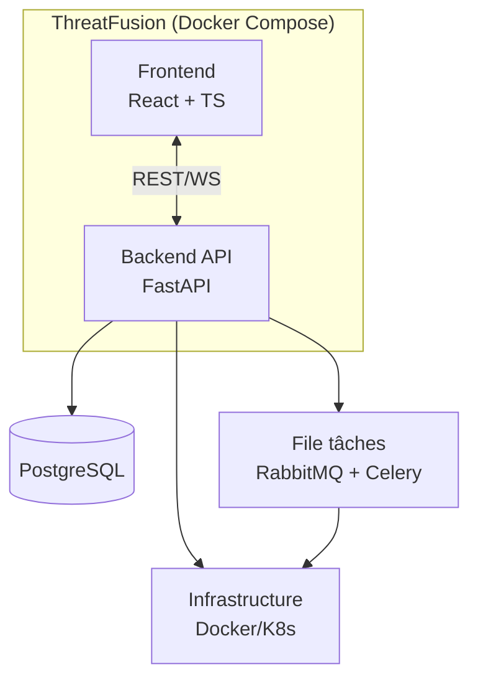

# Architecture

## Vue d'ensemble



## Composants

### Frontend (React + TypeScript)

- Dashboard listant les ressources et leur statut de santé
- Formulaire d'enregistrement d'une nouvelle ressource
- Vue historique/audit par ressource
- Connexion WebSocket pour les mises à jour de statut en temps réel

### Backend (FastAPI)

- API REST : CRUD ressources, déclenchement de déploiement, consultation d'audit
- Endpoint WebSocket : push du statut de santé en temps réel
- Couche d'agrégation : interroge les API Docker et Kubernetes et unifie leur état dans un modèle commun

### PostgreSQL

- Table `resources` : ressources enregistrées et leur config
- Table `deployments` : historique des déploiements
- Table `audit_log` : traçabilité de chaque action

### RabbitMQ + Celery

- Découple les opérations longues (déploiement, health-check périodique) de l'API, qui reste disponible pendant leur exécution
- Un worker exécute le déploiement réel (appel Docker/K8s) et met à jour PostgreSQL
- Une tâche planifiée (Celery beat) poll périodiquement la santé de l'infrastructure

### Infrastructure (Docker / Kubernetes)

- Cible réelle des déploiements et du monitoring
- Interrogée par les workers via leurs API/SDK respectifs

## Cycle fonctionnel

Chaque ressource suit un cycle continu :

```
Enregistrement → Monitoring → Déploiement → Audit
       ▲                                       │
       └───────────────────────────────────────┘
```

1. **Enregistrement** — le développeur déclare une ressource (nom, type, config, image)
2. **Monitoring** — la plateforme surveille en continu sa santé (Docker/K8s)
3. **Déploiement** — sur demande, un worker Celery exécute le déploiement réel
4. **Audit** — chaque action est loggée et consultable, reboucle vers un nouvel enregistrement si besoin

## Pourquoi cette architecture

Voir les [ADR](adr/) pour la justification détaillée de chaque choix technique.
